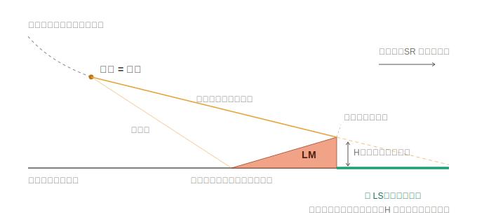

# SKEKB Layout — AutoCAD 配置スクリプト生成ツール (Python版)

SuperKEKB メインリングのマグネット・ビームパイプ（ダクト）配置を AutoCAD 上に
展開し、建設用の Duct_Table（一覧表）を Excel で出力し、Synrad3D の wall file を
生成するための、一連の Python ツールです。設計の概要から具体的な操作手順、
`config/` の中身、新規要素が入ったときの変更方法までをこの 1 文書にまとめています。

対象読者：加速器グループのメンバー（AutoCAD は使うが、Python の中身は深く
知らなくても運用できることを目指しています）。

---

## 1. 新システムの方針

本ツールは **「データ（対応表）と処理（プログラム）を分離する」** ことを中心方針に
しています。

```
        [ 編集可能な対応表・台帳 (config/) ]   ←  人が直す（JSON / CSV）
                     +
        [ 小さく透明なエンジン (Python) ]      ←  基本は変えない
                     +
        [ コマンドライン (dispog2scr.py 他) ]         ←  実行
```

* **対応表を `config/` に外出し** … 「マグネット名 → AutoCAD ブロック名」などの対応は
  すべて `config/` の JSON / CSV にあります。対応を変えたいときは、これらを編集する
  だけで済み、Python 本体は触りません。
* **幾何計算は忠実に実装** … 座標変換・区間角度・マグネット名の注記位置・octant 距離
  ラベルなどは、移植元（Excel/VBA）と同じ結果になるよう実装しています。
* **未解決要素を必ず報告** … ブロックが見つからない要素は一覧表示されます。「どの表に
  何を足せばよいか」がすぐ分かるようにしてあります。
* **環境非依存の出力** … 生成する `.scr` は Mac/Windows・日本語版/英語版の AutoCAD で
  そのまま動くようにしています（→ 第7章）。

新しい磁石・ダクトへの対応は、基本的に `config/` の編集だけで完結します。

---

## 2. 全体の流れ

```
  格子計算 (SAD 等)
        │  dispog ファイル (sler_*.dispog / sher_*.dispog)
        ▼
  ┌─────────────────────────────────────────────┐
  │  dispog2scr.py         … dispog → AutoCAD スクリプト  │   ← 手順1（第5章）
  │                   <name>_Mag.scr / _Duct.scr  │
  └─────────────────────────────────────────────┘
        │  .scr
        ▼
  ┌─────────────────────────────────────────────┐
  │  AutoCAD で SCRIPT 実行 → 図にブロックを配置    │   ← 手順2（第6章）
  └─────────────────────────────────────────────┘

  ┌─────────────────────────────────────────────┐
  │  duct_table.py  … dispog + 台帳 → Duct_Table  │   ← 手順3（第9章）
  │                   HER/LER_Duct_Table を .xlsx │
  └─────────────────────────────────────────────┘

  ┌─────────────────────────────────────────────┐
  │  synrad3d_wall.py … dispog + 断面 → wall file │   ← 第10章（試作）
  └─────────────────────────────────────────────┘

  すべての対応表・台帳は config/ にあり、人が編集できる。
  xlsm を更新したら extract_config.py で config/ を作り直せる（第13章）。
```

---

## 3. ファイル構成

```
skekb_layout/
├── dispog2scr.py                 ★ .scr 生成コマンド
├── duct_table.py            Duct_Table(建設用一覧表)を xlsx 書き出し
├── synrad3d_wall.py         Synrad3D wall file を生成（試作）
├── sr_cal.py                SR マスク熱負荷の簡易計算（旧 SR_Cal シート相当）
├── skekb_layout.py          コア（パース・幾何計算・スクリプト生成）
├── extract_config.py        xlsm から config/ を再生成するユーティリティ
├── README.md                このファイル
├── docs/                    README 用の図版（sr_mask_geometry.svg など）
└── config/                ★ 編集可能な設定・対応表・台帳（{her,ler} はリング別）
    ├── settings.json            幾何パラメータ・レイヤ名・色・挿入書式・クリア設定
    │
    │   ── .scr 生成（dispog2scr.py）で使う対応表 ──
    ├── {her,ler}_ducts.json     要素名 → 挿入するダクトブロック名リスト（"_Or" 込みの最終名）
    ├── {her,ler}_magnets.json   {"by_element": 要素名→ブロック名, "by_bn": BN→ブロック名}
    │
    │   ── Duct_Table 書き出し（duct_table.py）で使う台帳 ──
    ├── {her,ler}_component.json   Component シート（行の背骨。Mag Type/IP,CCG/RP/VSW/GV/設置日 等）
    ├── {her,ler}_ducttype.json    Duct_Type シート（断面/注記/BPM/NEG 等。ダクト名で引く）
    ├── {her,ler}_mag_others.json  Mag Others 列（手維持データを行位置で適用）
    │
    │   ── Synrad3D wall 生成（synrad3d_wall.py）で使う ──
    ├── wall_shapes.json           断面コード → 断面形状（頂点）の定義（自動生成できない断面のみ）
    └── legacy/                    旧分割形式のファイル退避（参照用。実行には使われない）
```

★印のファイルだけ理解すれば運用できます。`config/` は xlsm から
`python extract_config.py <xlsm>` ですべて再生成できます。

---

## 4. 動作環境とインストール

* **Python 3.9 以上**。
  * `.scr` 生成（`dispog2scr.py`）は **標準ライブラリのみ**で動きます（追加インストール不要）。
  * Duct_Table 生成（`duct_table.py`）・wall 生成（`synrad3d_wall.py`）・config 再生成
    （`extract_config.py`）は `openpyxl` が必要。`pip install -r requirements.txt` で
    入ります（xlsm の VBA 解析まで行う場合は `oletools` も）。
* **AutoCAD**（生成した `.scr` を読み込む）。AutoCAD 2027 for Mac と
  AutoCAD 2026 (Windows) で動作検証済み（前者の方が処理が速かったです）。
  Mac 版・Windows 版、日本語版・英語版のいずれでも動くよう作っています（→ 第7章）。

---

## 5. 手順1 — dispog から `.scr` を生成する（`dispog2scr.py`）

dispog ファイルを渡すと、マグネット用とダクト用の 2 つの `.scr` を作ります。
出力名は `<dispog名>_Mag.scr` / `<dispog名>_Duct.scr`。リング（HER/LER）は
ファイル名から自動判定します（`sler_*`→LER、`sher_*`→HER）。

```bash
# 両方生成（出力先 ./out）
python dispog2scr.py  sler_1802_60_1.dispog  -o ./out
# → ./out/sler_1802_60_1_Mag.scr  と  _Duct.scr が出来る
#   既定で「クリア」「配置後ロック」「軌道円弧」が付きます（下表参照）。
```

主なオプション：

| オプション | 意味 |
|------------|------|
| `-o <dir>` | 出力先フォルダ |
| `--ring HER` / `--ring LER` | リングを明示（ファイル名で判定できないとき） |
| `--mag-only` | マグネットスクリプトだけ生成 |
| `--duct-only` | ダクトスクリプトだけ生成 |
| `--preview` | ファイルを作らず、中身の要約だけ表示 |
| `--clear`（既定ON） | マグネット側の先頭に「対象リング図形の削除」処理を付ける（→ 6.3） |
| `--no-clear` | クリア処理を付けない |
| `--lock-after`（既定ON） | ダクト側の末尾に「全画層ロック」処理を付ける（→ 6.4） |
| `--no-lock-after` | 配置後の全画層ロックを付けない |
| `--arc`（既定ON） | 偏向磁石の軌道を円弧として専用画層に描く（→ 6.5） |
| `--no-arc` | 軌道円弧を描かない |

> **既定の動作**：オプションを付けなければ `--clear` `--lock-after` `--arc` がすべて有効です。
> つまり「対象リングを消して描き直し、偏向部に軌道円弧を描き、配置後に全画層をロックする」
> という通常運用がそのまま走ります。個別に外したいときだけ `--no-clear` /
> `--no-lock-after` / `--no-arc` を付けてください。実行時に
> `オプション: クリアON / 配置後ロックON / 軌道円弧ON` のように現在の状態が表示されます。

実行すると、配置数のサマリと **未解決要素**（対応表にブロックが無い要素）が
表示されます。未解決が出たら第12章の手順で `config/` に追記します。
`✓ 全要素のブロックを解決しました` と出れば対応表は完全です。

**座標変換**：dispog の `OGx, OGy`［m］を `X = OGx × (-1000)`、`Y = OGy × (-1000)`
で［mm］に変換して配置します（係数は `config/settings.json` の
`coordinate.scale_mm_per_m`）。

### 他プログラムからの利用（API）

```python
import skekb_layout as sk

# 1) パースだけ
elements = sk.parse_dispog("sler_1802_60_1.dispog")

# 2) マグネットスクリプト生成
#    （クリア・軌道円弧を付けるなら clear_layers=True, draw_bend_arcs=True）
result = sk.convert_dispog_to_magnet_scr(
    "sler_1802_60_1.dispog", "out_Mag.scr", ring="LER",
    clear_layers=True, draw_bend_arcs=True)
print("未解決:", result.unresolved)

# 3) ダクトスクリプト生成（配置後ロックを付けるなら lock_after=True）
sk.convert_dispog_to_duct_scr(
    "sler_1802_60_1.dispog", "out_Duct.scr", ring="LER",
    lock_after=True)
```

> ライブラリ関数（API）の `clear_layers` / `draw_bend_arcs` / `lock_after` は既定
> `False` で、上のように明示して有効化します。一方、コマンド `dispog2scr.py` ではこの
> 3つは**既定 ON**で、外すときに `--no-clear` / `--no-arc` / `--no-lock-after` を使います
> （CLI と API で既定が異なる点に注意）。

---

## 6. 手順2 — AutoCAD で `.scr` を読み込んでブロックを配置する

### 6.1 事前準備（重要）

`.scr` は**ブロックを「挿入」するだけ**です。マグネットやダクトの図形そのもの
（ブロック定義）は、あらかじめ図面（または参照する DWG）に登録されている必要が
あります。`.scr` が参照するブロック名は、`config/` の対応表が示すブロック
（例 `Q344E`、`D-QKALP`、`D-QKALP_Or`）です。

### 6.2 実行

1. ブロック定義の入った図面を開く。
2. コマンドラインに `SCRIPT` と入力（Mac 版はリボンが無いので**コマンド入力で実行**）。
3. 生成した `_Mag.scr` を選ぶ → マグネットが配置される。
4. 続けて `SCRIPT` → `_Duct.scr` を選ぶ → ダクトが配置される。

スクリプトは、レイヤ作成 → 点モード設定 → ブロック挿入 → マグネット名の文字 →
区間線（マグネット用）の順に流れます。配置先レイヤは `config/settings.json` の
リング別 `layers`（例 HER は `hermagnet`/`herduct`/`hermagnetname` …）。

> **ビーム軌道線について**：マグネットスクリプト（`_Mag.scr`）は最後に、各要素の
> 位置を順につないだ**ビーム中心線**を `_LINE` で 1 本描きます（`base` 画層）。
> AutoCAD 上で「軌道らしき線」が見えるのはこれです。ダクトスクリプトは線を引きません。
> 線が不要なら `base` 画層を非表示にするか、`config/settings.json` の `layers.base`
> を分けておくと一括で扱えます。

### 6.3 実行前クリア（既定ON、外すなら `--no-clear`）

既定で、**マグネットスクリプト（`_Mag.scr`）の先頭にだけ**「対象リングの
既存図形を消してから描き直す」処理が入ります（`--no-clear` を付けると外せます）。
**ダクトスクリプト（`_Duct.scr`）にはクリアは付きません**ので、「マグネット →
ダクト」の順に実行すれば、先に描いたマグネットが消えることはありません。
`--duct-only` のときはマグネットを作らないので、当然クリアも出ません（API では
`generate_magnet_script(elements, ring, clear_layers=True)` に相当）。

クリア処理の中身は次のとおり（すべて言語非依存の `_` 付きコマンド）：

1. 全レイヤをロック（`_-LAYER _LOCK *`）
2. 対象リング（`her*`/`ler*`）と共通レイヤ（`0,1,Base,Chamber,Defpoint,Dim`）をアンロック
3. `_ERASE _ALL` で削除（ロック層の図形は自動除外＝Ctrl+A+Del と同じ挙動）

アンロックする共通レイヤは `config/settings.json` の `clear.unlock_common` で編集できます。

> 実行手順はこれまでどおり「`_Mag.scr` を実行 → 続けて `_Duct.scr` を実行」です。
> クリアの付け先はツールが自動で制御するので、ユーザが気を付けることはありません。
> まっさらな図面に追記したい（既存図形を消したくない）ときだけ `--no-clear` を使います。

### 6.4 配置後に全画層をロック（既定ON、外すなら `--no-lock-after`）

既定で、**ダクトスクリプト（`_Duct.scr`）の末尾に**「全画層をロックする」処理
（`_-LAYER _LOCK *`）が入ります。配置がすべて終わった後に誤って図形を動かさない
ための安全策です（`--no-lock-after` で外せます）。`--mag-only` のときはダクトを
作らないのでロックも出ません（API では `generate_duct_script(..., lock_after=True)`
/ `convert_dispog_to_duct_scr(..., lock_after=True)`）。

```bash
# 既定（クリア＋軌道円弧＋配置後ロックがすべて付く）
python dispog2scr.py sler_1802_60_1.dispog -o ./out
#   _Mag.scr … 先頭でクリア＋偏向部に軌道円弧   _Duct.scr … 末尾で全画層ロック
```

> ロック後に手作業へ移るときは、第8章の `-LAYER` → `UNLOCK` → `*`（または
> 対象画層だけ）でロックを解除してください。配置後すぐ手作業を続けたいときは
> `--no-lock-after` を付けておくとロックされません。

### 6.5 偏向磁石の軌道円弧を描く（既定ON、外すなら `--no-arc`）

`_Mag.scr` のビーム中心線は各要素点を結んだ**折れ線**なので、偏向磁石内も直線
（弦）として描かれます。SR の光源（軌道弧への接点）を作図できるよう、既定で
偏向磁石の軌道を**本当の円弧**として専用画層に描きます（`--no-arc` で外せます）。

```bash
# 円弧だけ外したいとき
python dispog2scr.py sler_1802_60_1.dispog --no-arc -o ./out
```

- 各偏向磁石（B*）の入口→出口を、**dispog の軌道方位角 OChi1[deg] の変化分**を
  含み角とする円弧で結びます（`_ARC 始点 _E 終点 _A 含み角`）。OChi1 は各要素入口での
  水平面内の軌道方位なので、接線方向の推定が不要で、半径・接線・端点が厳密に再現され、
  **向きの反転が起きません**。
- 水平に曲がらない磁石（垂直偏向 BV*/BC* など、OChi1 がほぼ変化しないもの）は
  平面図では直線同然のため描きません。分割表現された磁石も各区間が正しい小弧になります。
- 半径は自動的に正しくなります（主偏向 LER B2P ≈74 m、HER B2E ≈106 m、ウィグラー
  BW* ≈15〜20 m など）。
- 円弧は専用画層 `{ler,her}orbitarc`（既定色 緑）に描かれるので、本体の図形とは
  分けて表示／非表示できます。画層名・色は `config/settings.json` の各リング
  `layers.bend_arc` / `bend_arc_color` で変更可。
- `--duct-only` と併用した場合はマグネットを作らないので円弧も出ません。

**SR 光源（接点）の作図手順**（→ 10.5 とあわせて）：

1. `_Mag.scr` を生成・実行すると軌道円弧が出ます（既定ON。外したいときだけ `--no-arc`）。
2. マスク頂点から、上流の偏向磁石の円弧へ `LINE` の `TAN`（接線）スナップで接線を
   引く。接点がSRの見かけの光源。
3. 接点からマスク始め・頂点までを `DIST` で測り、`sr_cal.py` の L1・L2 に使う。
   （ρ 自体は `--source-magnet` で dispog から自動取得できます。）

> 円弧は dispog の軌道方位(OChi1)から厳密に作られるため、折れ線（中心線）の節点
> 間隔やその推定には依存しません。

---

## 7. 生成される `.scr` の互換性（Mac / Windows / 日英）

出力スクリプトは、次の工夫により **AutoCAD for Mac / Windows のどちらでも、
また日本語版・英語版のどちらでも**同じファイルがそのまま動くようにしています。

* **改行コードは LF のみ**（`\r` を一切含まない）。点の区切りに `\r` が混じると
  Mac で挿入や線描画が途中で止まる原因になります。
* **挿入は尺度・回転を「点の前」に先付け**：`_-INSERT <ブロック> _S 1 _R <回転角> <座標>`
  の順。座標を最後に置くことで、点の確定後にプロンプトが出ず余分なトークンが
  はみ出しません（配置前に尺度・回転を設定する仕様に準拠）。
* **コマンドは `_` 付き**（`_-INSERT` `_POINT` `_TEXT` `_LINE` `_ZOOM` 等）で英語
  コマンドを強制し、**キーワードを使わず順番で指定**するため、日本語版 AutoCAD でも
  「r（回転）」等の翻訳に依存しません。
* **オブジェクトスナップは `OSMODE 0`** で解除（コマンドではなくシステム変数を使うので
  言語非依存）。

`config/settings.json` の `insert_command`（既定 `_-INSERT`）と `insert_scale`
（既定 `1`）で挿入の書式は調整できます。

---

## 8. 生成スクリプトが使っている AutoCAD コマンドの解説

`.scr` の中身は AutoCAD コマンドの列です。第7章の方針で書かれており、主なコマンドは
次のとおりです。

| コマンド（.scr 内） | 役割 |
|---------------------|------|
| `OSMODE 0` | オブジェクトスナップを解除（システム変数なので言語非依存）。意図しない点吸着を防ぐ。 |
| `_-LAYER _N <名> _C <色> <名>` | レイヤを作成し色を設定（`-LAYER` はダイアログを出さないコマンド版）。 |
| `PDMODE <値>` / 点サイズ | 点（`_POINT`）の表示形を設定（`settings.json` の `autocad.point_mode` 等）。 |
| `_ZOOM _A` / `_ZOOM _E` | 全体表示 / 図形範囲にズーム。 |
| `_-INSERT <ブロック> _S 1 _R <角度> <X,Y>` | **ブロック挿入**。尺度 `_S` と回転 `_R` を**座標の前**に先付けする確実な形式（座標が最後なので、点確定後に余計なプロンプトが出ない）。 |
| `_POINT <X,Y>` | 点を打つ（マグネット中心位置の目印など）。 |
| `_TEXT <X,Y> <高さ> <回転> <文字>` | マグネット名などの文字を書く。 |
| `_LINE … （空行）` | 区間線を引く（空行＝Enter でコマンド終了）。 |

クリア処理（既定ON / `--no-clear` で無効）で追加されるもの：

| コマンド | 役割 |
|----------|------|
| `_-LAYER _LOCK *` | 全レイヤをロック。 |
| `_UNLOCK <レイヤ>`（複数） | 対象リング（`her*`/`ler*`）と共通レイヤだけアンロック。 |
| `_ERASE _ALL` （空行で確定） | 全選択削除（ロック層の図形は除外＝Ctrl+A+Del 相当）。 |

> Mac 版 AutoCAD の小技：ブロック一覧は `-INSERT ? D*` で確認できます。コマンド履歴を
> 見たいときは `COPYHIST` でクリップボードにコピーできます（Mac は Text Window が
> 開けないため）。

### 8.1 手作業編集でよく使うコマンド（リファレンス）

スクリプト実行後の手作業（ダクトの差し替え・位置合わせ・ブロック編集など）で
使うコマンドのメモです。いずれもコマンドラインに直接入力すれば動きます
（Mac でもダイアログに頼らず操作できます）。

**オブジェクトスナップ（OSNAP / OSMODE）**

| 操作 | コマンド |
|------|----------|
| スナップ設定を開く | `OSNAP`（端点・中点・中心・交点などにチェック） |
| スナップを数値で設定 | `OSMODE 39`（= 端点1＋中点2＋中心4＋交点32 の合計） |
| スナップを切る | `OSMODE 0` |
| ON/OFF 切り替え | **F3** |
| 1点だけ強制スナップ | 点を聞かれたとき `END`（端点）/`MID`（中点）/`CEN`（中心）/`INT`（交点）と打ってからクリック |

- 生成 `.scr` は冒頭で `OSMODE 0` にします（数値座標どおりに置くため）。
  **スクリプト実行後に手作業へ移るときは `OSMODE 39` などで戻す**こと。
- `WBLOCK` で書き出した DWG は書き出し元の OSMODE 状態を引き継ぐので、
  開いたらまずスナップが ON か確認（頂点が拾えないときは大抵これが原因）。

**画層のロック / アンロック**

| 操作 | コマンド |
|------|----------|
| 全画層をロック | `-LAYER` → `LOCK` → `*` → Enter で終了 |
| 全画層をアンロック | `-LAYER` → `UNLOCK` → `*` → Enter で終了 |
| 特定の画層だけ | `*` の代わりに画層名（ワイルドカード可。例 `ler*` = ler で始まる画層） |

- `.scr` のクリア処理で使っている `_-LAYER _LOCK *` と同じものです（→ 第8章の表）。
- **現在画層もロックされる**点に注意。ロック層の図形は選択・編集不可になります
  （スナップで点を拾うことは可能）。
- ロック中の図形は薄く表示されます。薄さは `LAYLOCKFADECTL` で調整
  （0 で薄くしない、既定 50）。

**図形の選択（矩形 / 投げ縄）**

| 操作 | コマンド |
|------|----------|
| ドラッグ選択を矩形に戻す（投げ縄を無効化） | `PICKAUTO` → `1`（3 でも可） |
| 投げ縄（フリーハンド）選択を有効に戻す | `PICKAUTO` → `5`（既定値） |

- ドラッグするとフリーハンド（投げ縄）になるのは `PICKAUTO` のビット4が原因。
  Mac 版には設定ダイアログの項目が無いため、コマンドラインで変えるのが確実
  （Windows 版は `OPTIONS` → 選択タブ →「クリック＆ドラッグで投げ縄を使用」のチェックでも可）。
- 設定を変えなくても、**1回クリックして指を離し、対角をもう1回クリック**すれば
  常に矩形選択になります（投げ縄は「押したままドラッグ」のときだけ発動）。
- 矩形の向きの意味：**左→右**（青）＝枠に完全に入った図形だけ選択、
  **右→左**（緑）＝枠に少しでも触れた図形も選択。

**コピー＆ペースト**

| 操作 | コマンド |
|------|----------|
| 基点を指定してコピー | `COPYBASE`（基点をフランジ点などにスナップで取る）|
| 普通にコピー | `COPYCLIP`（Cmd+C） |
| 貼り付け | `PASTECLIP`（Cmd+V。挿入点を聞かれる） |
| 元の座標のまま貼り付け | `PASTEORIG`（図面間で絶対座標を保つ） |

**位置合わせ（ALIGN）** — フランジ面どうしを合わせる定番手順：

1. `PASTECLIP` 等でいったん貼る。
2. `ALIGN` → 対象を選択 → Enter。
3. 1点目：動かす側のフランジ点 → その移動先（相手フランジの対応点）。
4. 2点目：動かす側のもう1点（面の向きを決める点）→ その移動先。
5. 3点目は Enter で飛ばす →「尺度を合わせるか?」は通常 N。

2組の点対応で移動＋回転が一度に決まります。各点は `END` 等の上書きスナップで
正確に拾うこと。位置だけなら `MOVE`（基点→目標点）、向きだけなら `ROTATE` の
参照（Reference）オプションも使えます。

**ブロックの書き出し・編集・再定義**

| 操作 | コマンド |
|------|----------|
| ブロックを DWG に書き出し | `WBLOCK`（Source=Block でブロック名を選ぶ。CLI版は `-WBLOCK`） |
| 図面内でブロックを直接編集 | `BEDIT`（ブロックエディタ。保存すると全挿入に反映） |
| 編集した DWG でブロックを再定義 | `-INSERT ブロック名=/path/to/file.dwg`（同名の全挿入が更新される。挿入位置は Esc でキャンセル可） |
| ブロックを図形にばらす | `EXPLODE` |
| 定義済みブロックの一覧 | `-INSERT ? D*`（D で始まる名前を列挙。`?` の後にパターン） |

- **同じ名前で再定義** → そのブロックの全挿入が変わる。
  **別名で保存** → `config/{ring}_ducts.json` 等で当該要素だけ差し替えて再生成。

**別 DWG の取り込み**

| 操作 | コマンド |
|------|----------|
| 別 DWG をブロックとして挿入 | `-INSERT /path/to/file.dwg`（基点 0,0 指定で元の絶対座標に一致） |
| 別 DWG をリンク（外部参照） | `XATTACH`（元ファイル更新は `RELOAD` で反映） |

**その他（Mac で便利）**

| 操作 | コマンド |
|------|----------|
| コマンド履歴をコピー | `COPYHIST`（Mac は Text Window が無いため） |
| スクリプト実行 | `SCRIPT` |

---

### 8.2 既存ブロックを組み合わせて新しいブロックを作る手順

2つの既存ブロック（例：`DSAi0888aP_Or` の一部と `PMD06V2_1500aP_Or` の一部）を
組み合わせて新しいブロック（例：`PMD03V4_1500aP_Or`）を作り、`.scr` で並べるまでの
おすすめ手順です。

**最重要ポイント＝基点（原点）を崩さないこと。** ダクトブロックは要素の座標に
同じ基点で挿入され、ビームラインからのオフセットは**ブロック内部の図形位置**として
焼き込まれています（→ 11.2）。`WBLOCK` で書き出した DWG はブロック基点が原点に
なるので、これをベースに合成すれば基点管理が自動的に正しく保たれます。

1. **元ブロック2つを DWG に書き出す**：ブロック定義のある図面で
   `WBLOCK`（Source=Block → `DSAi0888aP_Or`）、同様に `PMD06V2_1500aP_Or` も。
2. **ベース側から新ファイルを作る**：主要形状を引き継ぐ方の DWG を開き、
   `SAVEAS` で `PMD03V4_1500aP_Or.dwg` として保存（原点＝基点ごと引き継ぐ）。
3. **スナップを ON に**：書き出した DWG は元図面の OSMODE を引き継ぐ（0 のことが
   多い）ので、まず `OSMODE 39` か F3。
4. **合成**：不要図形を削除し、相手ブロックを
   `-INSERT /path/to/PMD06V2_1500aP_Or.dwg` **挿入点 0,0・尺度1・回転0** で取り込み →
   `EXPLODE` → 不要部分を削除。部品の位置調整は `COPYBASE`→`PASTECLIP`、
   面合わせは `ALIGN`（点指定は `END`/`INT`/`CEN` の上書きスナップで正確に）。
5. **原点を確認して保存**：図形全体を原点に対して動かしていないか確認
   （元の DWG を `XATTACH` で重ねて見比べると確実。確認後 `DETACH`）。
6. **図面に新ブロックとして登録**：メイン図面で
   `-INSERT PMD03V4_1500aP_Or=/path/to/PMD03V4_1500aP_Or.dwg` →
   挿入位置は **Esc** でキャンセルしてよい（定義だけ登録される）。
7. **config に登録して再生成**：`config/{ring}_ducts.json` の並べたい要素に
   新ブロック名を追記（`_Or` まで含めて正確に）：

   ```json
   "QD5P.41": ["DQA1826uP_Or", "PMD03V4_1500aP_Or"]
   ```

   `python dispog2scr.py <dispog> --duct-only -o out` → AutoCAD で `SCRIPT`。

補足：

- **回転の向き**：`.scr` はブロックを要素の進行方向角で回して挿入します。元ブロックと
  同じ座標系（基点・向き）で合成していれば、新ブロックも自動的に正しい向きになります。
- **図面内で完結させる代替手順**：ブロック2個を空きスペースに挿入 → `EXPLODE` →
  合成 → `BLOCK`（CLI版 `-BLOCK`）で新名定義。この場合は**基点を自分で指定**する
  必要があり（ベース側の挿入点を `INS` スナップで拾う）、基点ミスが起きやすいため、
  慣れるまでは WBLOCK 方式を推奨します。
- 複数の要素に同じブロックを並べたいときは、`{ring}_ducts.json` の該当する各要素行に
  同じブロック名を足すだけです。

---

## 9. 手順3 — Duct_Table（Excel）を生成する（`duct_table.py`）

リング全体のマグネット配置・ダクト種類などをまとめた一覧表
（`HER_Duct_Table` / `LER_Duct_Table`）を `.xlsx` で出力します。

```bash
# HER と LER の両シートを 1 つの xlsx に
python duct_table.py --her sher_5781_60_1.dispog --ler sler_1802_60_1.dispog -o Duct_Table.xlsx

# 片方だけ
python duct_table.py --ler sler_1802_60_1.dispog -o Duct_Table.xlsx
```

### しくみ（Component 駆動）

`*_component.json`（Component シート）は Duct_Table と **1 行ずつ位置で対応する
「行の背骨」** です（HER 1105/1105・LER 1176/1176 行で (Mag名, Duct名) が完全一致する
ことを確認済み）。本ツールは Component を背骨として駆動し、各列を次の源から埋めます。

- **磁石・機器の台帳列**（Mag Type / BM Note / Q Support / Duct Name / IP,CCG / RP /
  VSW / GV / Bellows / Temp / Flow / 各設置日 / 真空 / NEG-L,R,Act / Length） …
  `config/*_component.json`
- **ダクト物理列**（Cross Section / Duct Note / BPM Height / NEG 群） …
  `config/*_ducttype.json` を Duct 名で引く
- **位置列（Loc / S）** … dispog を Mag 名で引いて再計算（IR cryostat 部は固定値）
- **Room** … Mag 名で D01..D12、さらに GV 列のセクター標識でサブ表記
  （D01_IRL / D01_STP / …）を付与
- **Mag Others** … `config/*_mag_others.json` から行位置で適用（手維持データ）
- **GV セクター境界行**（Duct Note が "GV"）には、その行の全列の上下に太め（thin）罫線を
  引く（通常行の細いグリッド線とは区別）

台帳（Component / Duct_Type / Mag Others）は dispog に無い手維持データです。最新の
xlsm が出たら `python extract_config.py <xlsm>` で再生成できます（第13章）。

> **なぜ `*_component.json` と `*_ducttype.json` は分けてあるのか（1本化しない理由）**
> 2つは対応の向きが違います。`component` は **1行＝1ダクト設置**で、同じ断面のダクトが
> 別の場所に何本も設置されれば**同じ Duct 名が複数行**に現れます（実測で LER 95 種・
> HER 96 種が複数行に重複）。一方 `ducttype` は **Duct 名ごとに 1 つだけ**の物理仕様
> （断面・BPM 高・NEG 種別など、その「型番」固有の情報）です。つまり
> 「設置の一覧（行が増える）」と「型番の諸元（重複しない）」という**多対一の関係**で、
> これは正規化された自然な分割です。1本化すると、型番の諸元を設置のたびに重複コピー
> することになり、断面情報を直したいときに全コピーを直す必要が生じてミスの温床に
> なります（しかも `ducttype` には、まだ設置されていない予備の型番も登録されており
> ―― LER 44 件・HER 10 件 ―― これらは設置一覧には現れません）。**断面を直すなら
> `ducttype` の 1 か所、設置を増減するなら `component` の行**、と役割が明確に分かれて
> いる現状を維持するのがメンテ上は有利です。

### xlsm 版との一致（実測）

行数は両リングとも完全一致。主要列は **IP,CCG / RP / VSW / GV / Mag Type / Mag Others が
100%**、Cross Section 99〜100%、Room 99%（差は GV 挿入由来のセクション境界 1 行ずれで、
いずれも Mag 名が空の境界行）。Mag Others は手維持データ（旧マクロが手作業の例外で特定行へ
振り分け）のため、xlsm から抽出して `config/*_mag_others.json` に保存し行位置で適用する
ことで全リング 100% 一致しています。

---

## 10. Synrad3D の wall file を生成する（`synrad3d_wall.py`・試作）

Bmad/Synrad3D の `wall_file`（真空チェンバ断面の定義）を、**既存の情報だけで半自動
生成**します。使う情報は 2 つだけです。

- 各要素の縦位置 **s** … dispog
- 各要素の **断面コード**（`f90x220_Ar`、`104x50`、`f80` など） … Duct_Type の Cross Section

```bash
python synrad3d_wall.py sler_1802_60_1.dispog -o sler_1802_LER.wall
```

出力は Synrad3D の namelist 形式（`&place` で s に断面を配置、`&shape_def` で断面形状を
定義）。Synrad3D は隣接断面間を補間するので、同一断面が続く区間は両端だけ置きます。

### 断面コード → 形状 の対応

| 種別 | 例 | 扱い |
|------|----|------|
| 矩形 `WxH` | `104x50`, `60x40` | **自動**（半幅 W/2・半高 H/2［m］） |
| 円 `fNNN` | `f80`, `f150` | **自動**（半径 NNN/2［m］の円弧） |
| テーパー `A-B`（`A^B`, `A-B-C`） | `f90-f90x220_Ar` | A,B,… を要素の前後に分けて配置（区間で補間＝テーパー） |
| アンテチェンバ等 | `f90x220_Ar`, `f90x220_St`, `f80x220_Ar`, `f90x220H24`, `f50x190_Ar` | **要定義**（`config/wall_shapes.json`） |

矩形・円は寸法から自動生成します。**自動で作れない断面（アンテチェンバ系など、実質
数種類）だけ `config/wall_shapes.json` に頂点を一度定義すれば、あとは全自動**です。
これが「半自動」の意味で、手入力はこの形状ライブラリの整備に限られます。

### `config/wall_shapes.json`（形状ライブラリ）

断面コードごとに `shape_def` を定義します。

```json
"f90x220_Ar": {
  "r0": [0.0, 0.0],
  "v": [
    [0.045, 0.0, 0.0, 0.0, 0.0],
    [0.045, 0.025, 0.045, 0.025, 0.0],
    [-0.045, 0.025],
    [-0.110, 0.025],
    [-0.110, 0.004],
    [-0.045, 0.004]
  ]
}
```

- `r0`：断面中心［m］。
- `v`：頂点 `[x, y, (radius_x), (radius_y), (tilt)]`［m］。反時計回り（θ 増加順）。
  - 全頂点が `x,y ≥ 0` なら両軸対称として 1/4 だけ、`y ≥ 0` のみなら x 軸対称として
    上半分だけの記述で済みます。
  - 頂点間は直線。`radius_x` を与えると円弧（`+`凸/`−`凹）、`radius_y` も与えると楕円弧。

未定義のコードは寸法から**仮の外接矩形**を置き、実行時に「要定義」と警告し、ファイル内にも
`! ← PLACEHOLDER` と印を付けます（例：`※ 要定義（仮形状）: f90x220H24, f90x220_St`）。
この数種を定義すれば完成です。

### 注意・確認事項

- 生成した wall の **s は Bmad ラティスの s と一致**している必要があります（dispog の s が
  機械 s と一致している前提）。`patch` 要素と重なる位置に断面を置けないなどの制約は
  Synrad3D 側の仕様（マニュアル参照）。
- アンテチェンバの**向き**（ウィングが内側／外側か）や中心オフセット `r0` は、リング側や
  偏向方向で変わり得ます。最終的な形状・向きは `wall_shapes.json` で確認してください。
- 本機能は試作です。まず数か所を Synrad3D の `-plot` で断面確認し、`wall_shapes.json` を
  詰めていく使い方を想定しています。

---

## 10.5 SR マスク熱負荷の簡易計算（`sr_cal.py`）

旧 xlsm の SR_Cal シート（偏向部からの放射光がマスクに与える熱負荷の見積もり）を
スクリプト化したものです。マスク（PM* など）の設計検討に使います。

```bash
python sr_cal.py --ler                       # LER の既定値（旧シート上段）で計算
python sr_cal.py --her                       # HER の既定値（旧シート下段）
python sr_cal.py --ler --L1 6200 --L2 6110   # 距離だけ差し替え
python sr_cal.py --E 4 --I 4 --rho 31.854 --L1 6495.8 --L2 6405.8 --LM 90.27 --H 10

# 光源の偏向磁石名を指定して ρ を dispog から自動計算（おすすめ）
python sr_cal.py --ler --dispog sler_1802_60_1.dispog --source-magnet BS2NP.1
python sr_cal.py --ler --dispog sler_1802_60_1.dispog --source-magnet B2P
#   ↑ 系列名でも可（B2P.* がすべて同じ ρ なら代表を自動選択）
```

### 入力と「光源」の取り方（重要）

| 入力 | 意味 |
|------|------|
| `--E` | ビームエネルギー [GeV] |
| `--I` | ビーム電流 [A] |
| `--rho` | 偏向半径 [m] |
| `--L1` | 光源 → マスク始め（面の根元）[mm] |
| `--L2` | 光源 → マスク頂点（先端）[mm] |
| `--LM` | マスク面の長さ [mm] |
| `--H` | マスクの高さ [mm] |

SR は偏向磁石内の**軌道全体**から接線方向に放射されるので、「光源」は磁石中心では
なく、**マスクを照らす光線が軌道弧に接する点（接点）**に取ります。



光源（接点）からの光は、**上流側の緩やかな斜面（長さ LM）**に浅い角度で当たって
パワーが分散され、**下流側の急峻な端（高さ H）**の先の壁に影（保護範囲 LS）が
できます。実用手順：

1. AutoCAD 上でマスク頂点から**上流の偏向軌道弧に接線**を引く（円弧への接線は
   `LINE` の `TAN` スナップで引けます）。
2. その**接点が光源**。接点からマスク始め・マスク頂点までの**直線距離**が L1・L2。
3. 磁石中心を光源にするのは、接点が分からないときの粗い近似にすぎません。
   マスクが磁石全長を見込むほど近い場合は点光源近似が崩れるので、弧を分割して
   評価してください。

### 曲率半径 ρ の取り方

ρ は**リング平均半径ではなく、そのマスクを照らしている偏向磁石の中の軌道半径**
（ρ = p/eB）です。ρ は臨界エネルギー（スペクトルの硬さ）と軌道角あたりのパワー
P/2π を決めるので、「光源になっている磁石」の値を入れることが重要です。

dispog の偏向磁石（B*）の Value 列は偏向角なので、**ρ = 長さ ÷ |Value|** で
その場で計算できます。`--source-magnet` を使えばこれを自動で行います：

```
$ python sr_cal.py --ler --dispog sler_1802_60_1.dispog --source-magnet BS2NP.1
  光源磁石: BS2NP.1  L=0.8935 m, θ=+0.028050 rad → ρ = 31.854 m
  ...
```

磁石の種類ごとに ρ は大きく違います（参考値）：

| リング | 磁石 | ρ |
|--------|------|-----|
| LER | B2P（アーク主偏向） | 74.1 m |
| LER | BS2NP / BS2OP（短い強偏向） | 31.854 m |
| HER | B2E（アーク主偏向） | 105.88 m |
| HER | BLA*/BLX*/BLY*（直線部） | 89〜180 m |

旧シートの既定値（LER 31.854 m）はアークの B2P ではなく **BS2 系の短い強偏向**
（ρ 最小＝SR が最も硬く強いワーストケース）、HER の 105.98 m は主偏向 B2E に
相当します。

### 計算内容（旧シートと同一）

- 臨界エネルギー `Er = 2.22·E³/ρ` [keV]、ローレンツ因子 `γ = E/0.511MeV`
- 全 SR パワー `P = 88.5×10³·E⁴·I/ρ` [W]（標準公式 P[kW]=88.46E⁴I/ρ と同じ）
- マスク三角形（光源・マスク始め・頂点）を余弦定理で解き、
  `t1` = 光源から見たマスク面の張角（= マスクが受けるSRファンの角度幅）
- 影の長さ `LS = H·tan(t4)`（マスクが下流に作る幾何学的影。符号は角の取り方による
  もので大きさが意味を持つ）
- 線パワー密度 `PL = P·(t1/2π)/LM` [W/m]（偏向部のSRは軌道角あたり P/2π で放射）
- SR の縦広がり `W = 2L1/γ` [mm]（開き角 ±1/γ）、面パワー密度 `PA = PL/W` [W/mm²]

既定値での結果：LER（4 GeV / 4 A / ρ=31.854 m）→ P=2.84 MW、PL≈5.5 kW/m、
PA≈3.3 W/mm²。HER（7 GeV / 3 A / ρ=105.98 m）→ P=6.01 MW、PL≈10.3 kW/m、
PA≈9.7 W/mm²。

---

## 11. `config/` の中身（各ファイルの意味）

`{her,ler}` はリング別（HER 用 / LER 用）に同じ構造で 2 つあります。

### 11.1 `settings.json` — 幾何・レイヤ・色・挿入書式・クリア設定

主な項目：

- `coordinate.scale_mm_per_m`：座標変換係数（既定 `-1000`、m→mm）。
- `geometry`：円周長、octant 数、名前ラベルのオフセット率など。
- `text.magnet_name_height`：マグネット名の文字高さ。
- `autocad`：点モード、`insert_command`、`insert_scale`。
- `HER` / `LER`：リング別の `layers`（レイヤ名・色。ビーム中心線 `base`、磁石名
  `magnet_name`、磁石 `magnet`、ダクト `duct`、軌道円弧 `bend_arc` など）、
  `element_suffix`（E/P）、名前ラベルのオフセット方向、除外規則、QC のサンプリングなど。
- `clear.unlock_common`：クリア時にアンロックする共通レイヤ。

### 11.2 `.scr` 生成で使う対応表

**`{her,ler}_ducts.json`** … 要素名 → **挿入するダクトブロック名リスト**。1ファイル
完結の単一マップで、ブロック名は `_Or`（オーダー済み）も含む**最終名**です。
「書いてある名前がそのまま図面に挿入される」（WYSIWYG）ので、ダクトの差し替えは
この 1 か所を書き換えるだけです。例：

```json
{
  "QD5P.41": ["DQA1826uP_Or", "DSAi2588bP_Or"],
  "QF4P.23": ["DQA2320uP_Or", "DSAir2308bP_Or", "PMD06H2_1500aP", "DSAi0608aP_Or"]
}
```

**`{her,ler}_magnets.json`** … マグネット対応を 1 ファイルにまとめたもの。
2 つの節があります：

```json
{
  "by_element": { "QC1LPE435": "Q10E", "QKALE": "QKnewE", ... },
  "by_bn":      { "B1239": "B1239E", "Q560": "Q560E", ... }
}
```

- `by_element`：要素名 → ブロック名の**直接マップ**（Lattice 由来の正解。最優先）。
- `by_bn`：BN（先頭文字＋長さmm の種別キー）→ ブロック名。`by_element` に無い要素は
  名前と長さから BN を導出してここで引きます。ステアリングなど同型多数の磁石を
  少数のキーでカバーするためのフォールバックです。

**解決の優先順位**

- マグネット：①`by_element`（要素名そのもの → 先頭 `-` を除いた名前）→
  ②BN を導出して `by_bn`。
- ダクト：`{ring}_ducts.json` の単一マップのみ（要素名そのもの → 先頭 `-` を除いた
  名前）。フォールバックはありません。未登録なら「未解決」として報告されます。

> **旧形式からの変更** … 以前は `*_duct_by_element` / `*_duct_blocks`（DuctBN 表）/
> `*_duct_ordered`（`_Or` 付与リスト）/ `*_mag_by_element` / `*_mag_blocks` /
> `*_mag_overrides.csv` の 6 種に分かれていました。現行ラティスでは DuctBN 表と
> overrides は一度も使われていない（直接マップが全要素をカバーしている）ことを
> 確認したうえで、ダクトは 1 ファイル、マグネットは 1 ファイル（2 節）に統合しました。
> 旧ファイルは `config/legacy/` に保存してあり、実行には使われません。

### 11.3 Duct_Table 生成で使う台帳

**`{her,ler}_component.json`** … Component シートそのもの（**表の行の背骨**）。
Mag Name / Mag Type / Duct Name / IP,CCG / RP / VSW / GV / Bellows / 各設置日 など、
手で維持する機器情報が 1 行ずつ入っています。

**`{her,ler}_ducttype.json`** … Duct_Type シート（ダクト名 → 断面・注記・BPM 高・
NEG など）。ダクト名で引きます。例：

```json
{ "DBAk3340aE": { "Cross Section": "104x50", "Note": "", "BPM Height": "", ... } }
```

**`{her,ler}_mag_others.json`** … Duct_Table の Mag Others 列（同居するステアリング系の
リスト）を**行位置で**保持。手作業の例外で特定行へ振り分けられた手維持データのため、
計算で作らず台帳として持っています。

### 11.4 wall 生成で使うライブラリ

**`wall_shapes.json`** … 断面コード → 断面形状（頂点）の定義。矩形・円は自動生成
されるので、自動生成できない断面（アンテチェンバ系など）だけを書きます（第10章）。

> `*_component.json` / `*_ducttype.json` / `*_mag_others.json` などの台帳は dispog には
> 無い手維持データです。最新の xlsm から `extract_config.py` で作り直せます（第13章）。

### 11.5 ダクトブロック名の命名規則（旧 Denotation シートより）

`{ring}_ducts.json` などに現れるダクト名は、次の規則で構成されています
（旧 xlsm の Denotation シートの凡例）。

```
 D  S  A  i  2588  b  P  (_Or)
 │  │  │  │   │    │  │    └ 付加記号
 │  │  │  │   │    │  └ リング
 │  │  │  │   │    └ 種別/位置の小文字
 │  │  │  │   └ 数字4桁 = ダクト長 [mm]
 │  │  │  └ 装備の小文字（複数可）
 │  │  └ 3文字目: 区域・系統
 │  └ 2文字目: ダクトの形式
 └ 1文字目: D = Duct
```

| 位置 | 記号と意味 |
|------|-----------|
| 1文字目 | `D` = Duct |
| 2文字目（形式） | `B` Bend ／ `Q` Quad ／ `S` Straight ／ `T` Taper |
| 3文字目（区域・系統） | `A` Arc（アンテチェンバ）／ `W` Wiggler ／ `K` KEKB ／ `R` RF ／ `C` Circular ／ `L` LC ／ `X` Skew SX ／ `F` Fuji |
| 装備の小文字 | `i` IP 付き ／ `g` GV 付き ／ `r` ラフポンプ付き ／ `h` high mask ／ `v` long mask ／ `c` Cu ／ `b` ベローズ形式 ／ `s`,`t` サポート形式 |
| 数字4桁 | ダクト長 [mm]（例 `2588` → Duct length 2588） |
| 末尾前の小文字 | `a`–`d` 種類（バリエーション）／ `u` Q 上流側 ／ `d` Q 下流側 ／ `f`–`g` タイプ |
| 末尾 | `P` = Positron（LER）／ `E` = Electron（HER） |
| 付加記号 | `_Or` = オーダー済み ／ `_OrO` = Ordered Original |

読み方の例：

- `DSAi2588bP` = Duct / Straight / Arc / **IP付き** / 長さ 2588 mm / 種類 b / LER
- `DQA1826uP` = Duct / Quad / Arc / 長さ 1826 mm / **Q 上流側** / LER
- `DSAir2308bP` = Straight・Arc に **IP とラフポンプ**付き / 2308 mm / b / LER
- `DQAs2320dP` = Quad・Arc・**サポート形式 s** / 2320 mm / **Q 下流側** / LER

補足：凡例に無い小文字の連なりが入ることもあります（例 `DSAidum2588bP` の
`dum` = ダミー、`DQAn1826dP` の `n` = 新型）。また `PM*`（Particle Mask、例
`PMD03V4_1500aP`）は別系統の命名（PM + 区域 D03 + V/H 番号 + `_長さ` + 種類 + リング）
で、この表の対象外です。

---

## 12. 対応表のメンテナンス（新規マグネット・ダクトの追加）

基本は **`config/` の該当ファイルに追記するだけ**。Python 本体は変更しません。
追記後はそのリングの dispog で再生成し、未解決が消えたか確認します。

### 12.1 新しいマグネットが未解決になった場合

`dispog2scr.py` 実行時に例えば `未解決: QNEWLE` と出たら：

1. その要素に対応する AutoCAD ブロック名を決める（既存図面のブロックを確認）。
2. `config/{ring}_magnets.json` の `"by_element"` に 1 行追加：
   `"QNEWLE": "QNEW_blockE"`
3. 同じ種別（BN）の磁石が今後も増えるなら、同ファイルの `"by_bn"` に
   `"BNキー": "ブロック名"` を足すと、要素名を個別登録しなくても解決できます。
4. 再生成して確認：`python dispog2scr.py sler_1802_60_1.dispog --ring LER --mag-only --preview`

### 12.2 ビームダクトの追加・差し替え

直す場所は **`config/{ring}_ducts.json` の 1 か所だけ**です。

- **差し替え**：該当要素の行で、ブロック名を書き換える。例（`QD5P.41` の 2 本目を
  パーティクルマスクに交換）：

  ```json
  "QD5P.41": ["DQA1826uP_Or", "PMD03V4_1500aP"]
  ```

- **追加**：未解決と報告された要素名をキーに、挿入したいブロック名リストを追加。
- **`_Or`（オーダー済み）**：ブロック名に直接 `_Or` を付ける／外すだけです。
  書いた名前がそのまま挿入されます（図面側に同名ブロックが定義されている必要あり）。
- 再生成して確認（`--duct-only`）。

### 12.3 Duct_Table にも新しい行・列値を反映したい場合

Duct_Table は Component（行の背骨）・Duct_Type・Mag Others の台帳から作ります。

- **おすすめ（確実）**：元の xlsm に新規行・機器情報を追記し、
  `python extract_config.py <その xlsm>` で台帳 config を作り直す（第13章）。
  Component の行構成・GV 境界行・Mag Others の振り分けは手維持データなので、xlsm を
  「正」として更新するのが安全です。
- **手早く直す**：`{ring}_ducttype.json` にダクトの断面・注記等を 1 件追加すれば、
  そのダクトの物理列は引けます。ただし**行（Component の背骨）自体の追加は xlsm 経由が
  確実**です。

### 12.4 幾何・レイヤ・色を変えたい場合

`config/settings.json` を編集します（レイヤ名・色、文字高さ、座標スケール、クリア時の
アンロック対象など）。

### 12.5 マグネット名表示・ダクト角度のリング別調整

マグネット名の注記とダクトの角度計算は HER と LER で定数・方向が異なり、
`config/settings.json` のリング別設定で再現しています。

- 名前ラベルのオフセット方向：HER は X<0→内/X≥0→外、LER は逆（X<0→外/X≥0→内）。
  これを誤るとマグネット名がビームラインの反対側（上下逆）に出ます。
- Q 磁石の距離ラベル（例 `(TR148)`）の octant 計算定数もリングで異なります。
- 除外規則：LER は先頭 "D" も除外し、長さ 0 でも "SK**" は残します。
- 反転要素（先頭 "-"、例 `-QLA7RP`/`-BLA6RP.1`）は、名前表示では "-" を除き、Q/B 判定にも
  除去後の名前を使います。これによりダクトの角度（偏向磁石の 2 個目以降のダクトは
  「もう一つ前」の角度）が正しく計算され、段差が出ません。
- ダクト角度には X<0,Y≥0 での「角度<-80°なら +180°」補正（日光シケイン）も含みます。

---

## 13. xlsm から `config/` を作り直す（`extract_config.py`）

Excel 側で対応表・台帳を更新したら、最新の xlsm を渡して `config/` 一式を
再生成できます。

```bash
python extract_config.py  path/to/SKEKB_Layout_latest.xlsm
```

これで次がまとめて作り直されます：`{ring}_ducts.json`・`{ring}_magnets.json`（旧分割
ファイルから統合。オーダー済み `_Or` はセル色から判定して焼き込み）、Component /
Duct_Type 台帳、Mag Others 列。旧分割形式は `config/legacy/` に退避されます。再生成後はバックアップ（または Git）で差分を確認すると安心です。

---

## 14. 旧VBA との対応（移植元の対照表）

| 本ツール | 旧VBA |
|----------|-------|
| `parse_dispog()` | `HER_Lattice` シートへの dispog 貼り付け |
| `MagnetBlockResolver` | `HERInsertMagnetBlockName` / `LERInsertMagnetBlockName` |
| `generate_magnet_script()` | `Make_HER_Mag_ScriptFile` / `Make_LER_Mag_ScriptFile` |
| `DuctBlockResolver` | `HERInsertDuctBlockName` / `LERInsertDuctBlockName` |
| `generate_duct_script()` | `Make_HER_Duct_ScriptFile` / `Make_LER_Duct_ScriptFile` |
| `duct_table.py` | `Make_HER_Duct_Table` / `Make_LER_Duct_Table` |
| `config/*_magnets.json` / `*_ducts.json` | `*_MagBlock` / `*_DuctBlock` シート + Lattice セルの割当 |
| `config/*_component.json` 他台帳 | `*_Component` / `*_Duct_Type` シート |
| （`by_element` 直接マップに統合） | VBA 内の `If Cells(i,1)=…` 分岐群 |
| `config/settings.json` | VBA 内の定数（`-1000`, レイヤ名, `pdmode` 等） |

### 忠実に実装した処理

* 座標変換 `X = OGx × -1000`, `Y = OGy × -1000`（mm 化）
* 区間の角度計算（`atan` ＋ 象限別の +90/-90/+180 補正、鉛直区間の 90/270）
* 偏向磁石（先頭 `B`）で `Value < 0` のときブロックを 180° 反転
* マグネット名注記の位置（区間中点を内外へ ±0.4% オフセット）
* Q 磁石の距離ラベル（`TL/NR/NL/FR/FL/OR/OL/TR` ＋ octant 内距離）
* QC1/QC2 は代表 1 本だけ名前を表示するサンプリング
* 除外規則（先頭 `P` または長さ 0 の要素はスキップ 等）
* ステアリングや Half-Q、特殊 Q、ウィグラー `BW` の up/down 判定

---

## 15. うまくいかないとき（Mac の注意点を含む）

- **ブロックが入らない／途中で止まる**：参照しているブロック名が図面に未定義の可能性。
  `-INSERT ? D*` で定義済みブロックを確認。`.scr` の改行が LF か（CR が混じると Mac で
  停止しやすい）。
- **マグネット名が線の反対側（上下逆）に出る**：リング別のラベルオフセット方向の設定
  （`settings.json` の `label_offset`）。HER と LER で向きが逆です（→ 12.5）。
- **未解決要素が残る**：第12章のとおり `*_by_element.json` 等に追記。
- **Mac でコマンド履歴を見たい**：`COPYHIST` でクリップボードにコピー（Text Window は
  Mac では開けない）。コマンドラインのパレットを広げて確認することも可。
- **Duct_Table の値が合わない**：台帳（Component/Duct_Type/Mag Others）が古い可能性。
  最新 xlsm から `extract_config.py` で作り直す。

困ったときは、まず `dispog2scr.py ... --preview` で中身を確認し、未解決要素の一覧を
手がかりに `config/` を直す、という流れが基本です。

---

## 16. 既知の制限・今後の発展

* **検証は対象比較で**：本ツールの出力は、実機の図面・既知の正解 `.scr` や既存の
  Duct_Table と照合して確認することを推奨します。未解決要素レポートが差分発見の
  助けになります。
* **Synrad3D wall は試作**：アンテチェンバ断面の形状ライブラリ整備と、`-plot` での
  断面確認を前提とした半自動生成です。
* **発展の方向**
  * `ezdxf` を使って `.scr` を介さず `.dxf` を直接生成（AutoCAD コマンド非依存）
  * 対応表の編集 UI／変更履歴管理
  * 複数 dispog の一括処理・差分レイアウト
